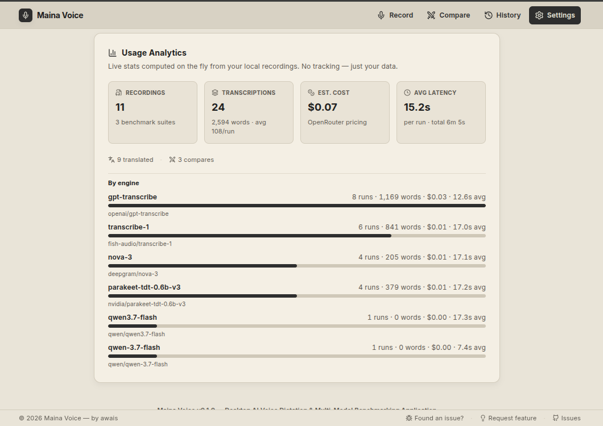

# Maina Voice

A browser-based voice transcription app that lets you record audio, send it to cloud speech-to-text engines, and compare their speed and accuracy side by side. Everything stays local — no server, no account, no sync.

By [Awais Alwaisy](https://alwaisy.dev) &nbsp;|&nbsp; MIT License


---

## What it does

**Record mode** — pick a speech engine, record your voice, and get a transcription back. You can re-transcribe the same recording with a different engine to compare outputs without re-recording.

**Benchmark mode** — run two engines on the same audio at the same time and see which one finishes first, with a relative speed ratio between them.

**History** — every transcription is saved locally with version tracking. If you re-transcribe, the old version is kept. You can diff them, copy them, or delete them.

**Backup and restore** — export everything (recordings, transcriptions, settings) as a ZIP archive. The filename includes your local time and IANA timezone so you can tell backups apart at a glance.

## Usage Analytics & Cost Analysis



### Word-by-Word Cost Breakdown: Wispr Flow vs. Maina Voice

| Usage Scale | Monthly Words | Estimated Audio Time | **Wispr Flow Pro** | **Maina Voice (OpenRouter API)** | **Your Monthly Savings** |
| --- | --- | --- | --- | --- | --- |
| **Light Dictation** | **2,000 words** | ~15 minutes | **\$0.00** *(Free Tier Cap Limit)* | **~\$0.05** | *Free tier limit hit on Flow* |
| **Casual User** | **10,000 words** | ~1.2 hours | **\$15.00** / mo ($180/yr) | **~\$0.27** | **Save \$14.73 / month (98.2%)** |
| **Power Dictator** | **30,000 words** | ~3.5 hours | **\$15.00** / mo ($180/yr) | **~\$0.81** | **Save \$14.19 / month (94.6%)** |
| **Heavy Professional** | **100,000 words** | ~12 hours | **\$15.00** / mo ($180/yr) | **~\$2.70** | **Save \$12.30 / month (82.0%)** |
| **Enterprise / Heavy** | **250,000 words** | ~30 hours | **\$15.00** + Team upsell | **~\$6.75** | **Save \$8.25 / month (55.0%)** |

> *Note: Maina Voice costs calculated based on real benchmarked usage from the dashboard above (~2,594 words processed for \$0.07 across models like OpenAI GPT-Transcribe, Fish Audio Transcribe-1, Deepgram Nova-3, and NVIDIA Parakeet).*

### Key Advantages over Wispr Flow

1. **Pay ONLY for What You Use**: Wispr Flow forces a **\$15/month (\$144/year)** subscription lock-in regardless of whether you transcribe 500 words or 50,000 words in a month. With Maina Voice, light users spend literally **pennies per month**.
2. **No Word Caps or Artificial Paywalls**: Wispr Flow limits free users to **2,000 words per week** (~15 minutes of speech total). Maina Voice has zero word limits — you use your own OpenRouter key directly.
3. **Multi-Engine Benchmarking & Choice**: Wispr Flow locks you into a single proprietary pipeline. Maina Voice gives you 4+ world-class speech models (OpenAI, Deepgram, NVIDIA, Fish Audio) with side-by-side speed and accuracy benchmarking.
4. **100% Data Privacy & Local Storage**: Wispr Flow requires cloud account sync and telemetry. Maina Voice stores all audio, transcriptions, and edit history in browser **IndexedDB** locally — nothing leaves your device except direct HTTPS API calls to your chosen speech provider.

### How the Audio-to-Word Calculation Works (The Math & Framework)

If someone asks **"How did you convert word count to audio time, and vice versa?"**, here is the exact empirical framework and formula used in Maina Voice:

#### 1. The Speech Rate Standard (WPM & WPS)
- **Natural Dictation Speed**: Standard conversational dictation ranges between **140 to 160 Words Per Minute (WPM)**.
- **Conversion Factor**:
  $$\text{Words Per Second (WPS)} = \frac{150\text{ WPM}}{60\text{ seconds}} = 2.5\text{ words/sec}$$
  $$\text{Audio Seconds per Word} = \frac{1}{2.5} = 0.4\text{ seconds/word}$$

#### 2. Conversion Formulas

$$\text{Estimated Audio Minutes} = \frac{\text{Total Words}}{150\text{ WPM}}$$

$$\text{Estimated Words} = \text{Audio Seconds} \times 2.5$$

#### 3. Empirical Cost Benchmark (From Live Data)

Our calculation is grounded directly in the live data captured in the telemetry dashboard above:
- **Sample Data**: 24 runs, **2,594 words**, total audio ~365 seconds (~6.08 minutes).
- **Recorded Cost**: **\$0.07 total** across OpenRouter models (OpenAI GPT-Transcribe, Fish Audio Transcribe-1, Deepgram Nova-3, NVIDIA Parakeet).
- **Unit Cost Metric**:
  $$\text{Cost per 1,000 Words} = \frac{\$0.07}{2,594} \times 1,000 = \$0.02699\quad (\sim \$0.027\text{ per 1k words})$$
  $$\text{Cost per Minute of Audio} = \frac{\$0.07}{6.08\text{ mins}} = \$0.0115\quad (\sim \$0.011\text{ per minute})$$

#### 4. Real-World Projection Matrix

| Category | Words / Month | Formula Calculation | Estimated Audio Time | OpenRouter Cost (Maina) | Wispr Flow Flat Fee |
| --- | --- | --- | --- | --- | --- |
| **Casual** | 10,000 words | $10,000 \div 150\text{ WPM}$ | ~66.6 mins (~1.1 hrs) | **~\$0.27** | **\$15.00** |
| **Moderate** | 30,000 words | $30,000 \div 150\text{ WPM}$ | ~200 mins (~3.3 hrs) | **~\$0.81** | **\$15.00** |
| **Heavy** | 100,000 words | $100,000 \div 150\text{ WPM}$ | ~666 mins (~11.1 hrs) | **~\$2.70** | **\$15.00** |

## Supported engines

All transcription goes through [OpenRouter](https://openrouter.ai), so you only need one API key to access all of them:

- Fish Audio Transcribe-1
- OpenAI GPT-Transcribe
- Deepgram Nova-3
- NVIDIA Parakeet

## Tech stack

- [Vue 3](https://vuejs.org) with Composition API (`<script setup>`)
- [Vite](https://vite.dev) as the build tool
- [TypeScript](https://www.typescriptlang.org) in strict mode
- [Tailwind CSS v4](https://tailwindcss.com) via `@tailwindcss/vite`
- [Pinia](https://pinia.vuejs.org) for state management
- [Reka UI](https://reka-ui.com) for accessible UI primitives
- [IndexedDB](https://developer.mozilla.org/en-US/docs/Web/API/IndexedDB_API) for local storage (no backend)
- [Web Audio API](https://developer.mozilla.org/en-US/docs/Web/API/Web_Audio_API) for audio conversion

## Getting started

### Prerequisites

- [Node.js](https://nodejs.org) 20+
- [pnpm](https://pnpm.io) 9+
- An [OpenRouter](https://openrouter.ai) API key

### Install and run

```bash
git clone https://github.com/alwaisy/mainavoice-web.git
cd mainavoice
pnpm install
pnpm dev
```

Open the app in your browser, go to Settings, and paste your OpenRouter API key. That is all the setup there is.

### Build for production

```bash
pnpm build
pnpm preview
```

## Project structure

```
src/
  assets/       Global styles and Tailwind setup
  components/   UI components and dialogs
    ui/         Primitive components (Reka UI wrappers)
  i18n/         Localization files
  layouts/      Shared layout components
  lib/          Utility functions
  pages/        Page views (Record, Compare, History, Settings, Audio Detail)
  router/       Route definitions
  schemas/      Zod validation schemas
  services/     Transcription, transliteration, backup, and DB logic
  stores/       Pinia stores
public/         Static assets, icons, PWA manifest
```

## How the audio pipeline works

The browser's `MediaRecorder` API captures microphone input as WebM or Ogg depending on the platform. Before sending to any cloud provider, `transcription-service.ts` decodes the audio and re-encodes it as 16-bit PCM WAV using the Web Audio API. This normalizes the format across browsers and avoids provider-specific rejection errors.

Transcriptions go to OpenRouter's `/v1/audio/transcriptions` endpoint. The selected model determines which provider handles the request.

## Data and privacy

Nothing leaves your device except the audio you explicitly send for transcription. Recordings, transcriptions, and settings are stored in IndexedDB under the key `mainavoice_indexeddb`. There is no telemetry, no analytics, and no external database.

Your OpenRouter API key is stored in IndexedDB and passed via HTTP `Authorization: Bearer` headers. It never touches any server other than OpenRouter.

## Transliteration

When the transcribed text contains Devanagari script, Maina Voice can automatically transliterate it to Urdu. This runs offline using a local character mapping in `transliteration-service.ts` and can be toggled per page in Settings.

## Contributing

Run the full check before opening a pull request:

```bash
pnpm check   # runs lint:fix, lint, and typecheck in sequence
```

Other available commands:

```bash
pnpm dev          # start dev server
pnpm build        # production build
pnpm lint         # lint only
pnpm lint:fix     # auto-fix lint issues
pnpm typecheck    # type check only
pnpm clean        # remove build artifacts
pnpm shadcn       # add a Reka UI component
```

A few things to know before contributing:

- Commits follow [Conventional Commits](https://www.conventionalcommits.org): `feat:`, `fix:`, `chore:`, `docs:`, etc.
- All PRs must pass `pnpm check` with zero errors.
- Components use `<script setup>` only. No Options API.
- Formatting is handled by `@antfu/eslint-config`: 2 spaces, single quotes, no semicolons.
- State changes go through store actions, not direct mutation.

## License

MIT. See [LICENSE.md](./LICENSE.md).
